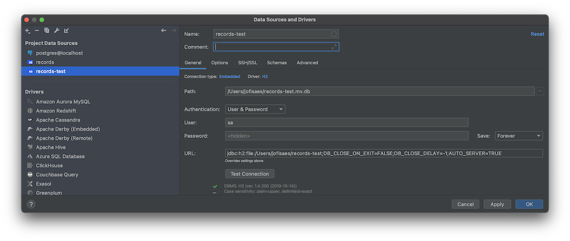

# jee-app-3-wildfly

---

[](https://www.oracle.com/nl/java/)
[](https://projectlombok.org/)
[](https://openjdk.java.net/)
[](https://sdkman.io/)
[](https://www.wildfly.org/)
[](https://github.com/arquillian)

---

## Exercise

The apps under [jee-apps](../..), cover lots of topics. For this app we cover:

1.  `@Entity` and `@Table`
2.  `javax.ejb.TransactionManagementType.BEAN` vs `javax.ejb.TransactionManagementType.CONTAINER`
3.  `@OneToMany` and `@ManyToOne` (NOTE: They have to be either all member instances, either all member methods. mixed won't work)
4.  `@OneToOne` The same rule applies as in point 3.
5.  `@Enumerated` JPA entities
6.  Abstract and final JPA entities -> [Requirements for Entity Classes](https://docs.oracle.com/javaee/5/tutorial/doc/bnbqa.html)
7.  `@Stateful`, `@Cache`, `@PrePassivate`, `@PostActivate`, `Serializable`, `@Local`, `java:module`, `InitialContext`
8.  `transient`, `@OneToMany(fetch = FetchType.EAGER)`,  `@OneToMany(fetch = FetchType.LAZY)`
9.  `@Singleton`, `@Stateful`, `@Stateless,` `SessionContext`,  `@Timeout`, `@Resource`, `context.getTimerService()`
   and `TimerService`
10. `@TransactionAttribute` and `TransactionAttributeType`
11. `MANDATORY`, `REQUIRED`, `REQUIRES_NEW`, `SUPPORTS`, `NOT_SUPPORTED`, `NEVER` TransactionAttribute
12. `Rollback`
13. `@Enumerated(EnumType.STRING)`, `@Enumerated(EnumType.ORDINAL)`

## Domains in detail

-   [Domain](src/main/java/org/jesperancinha/jtd/jee/teeth/domain) - `@OneToMany` and `@ManyToOne`
-   [Domain1](src/main/java/org/jesperancinha/jtd/jee/teeth/domain1) - TransactionManagementType.BEAN
-   [Domain2](src/main/java/org/jesperancinha/jtd/jee/teeth/domain2) - TransactionManagementType.CONTAINER

## Test Endpoints

1.  [http://localhost:8080/jeorg-jee-app-3-wildfly/periodontitis](http://localhost:8080/jeorg-jee-app-3-wildfly/periodontitis) - Passivation Exercise
2.  [http://localhost:8080/jeorg-jee-app-3-wildfly/periodontitis?count=700&activate=1](http://localhost:8080/jeorg-jee-app-3-wildfly/periodontitis?count=700&activate=1) - Passivation Exercise
3.  [http://localhost:8080/jeorg-jee-app-3-wildfly/tooth/servlet/all](http://localhost:8080/jeorg-jee-app-3-wildfly/tooth/servlet/all) - Domain Data, use of EAGER and JSON generation from Entity
4.  [http://localhost:8080/jeorg-jee-app-3-wildfly/app/tooth/rest/all](http://localhost:8080/jeorg-jee-app-3-wildfly/app/tooth/rest/all) - Domain Data, use of EAGER and JSON generation from Entity
5.  http://localhost:8080/jeorg-jee-app-3-wildfly/timer/servlet/stateless - TimeService
6.  http://localhost:8080/jeorg-jee-app-3-wildfly/timer/servlet/stateful - TimeService
7.  http://localhost:8080/jeorg-jee-app-3-wildfly/timer/servlet/singleton - TimeService
8.  http://localhost:8080/jeorg-jee-app-3-wildfly/tooth/servlet/tx/all - Transaction type

## How to run

1.  Stop your wildfly server
2.  Run setup.sh
3.  Start Wildfly with switch `-c standalone-full.xml`

## How to check your database in Intellj


Database connection properties:

1.  URL -> `jdbc:h2:file:~/records;DB_CLOSE_ON_EXIT=FALSE;DB_CLOSE_DELAY=-1;AUTO_SERVER=TRUE`
2.  Username -> `sa`
3.  Password -> `sa`

> Path details must be absolut in IntelliJ versions up until 2020.3. At least, this is how I experienced it.

If you run the arquillian tests, very little changes:



Database connection properties:

1.  URL -> `jdbc:h2:file:mem:records;AUTO_SERVER=TRUE`
2.  Username -> `sa`
3.  Password -> `sa`
## Run Arquillian tests

Make sure port 9990 is available:

```bash
lsof -i :9990
```

```bash
jenv local system
sdk use java 11.0.9.hs-adpt
mvn clean install -Parq-wildfly-managed
```

## Troubleshooting

### EJB sub system

```xml

<subsystem xmlns="urn:jboss:domain:ejb3:5.0">
    ...
</subsystem>
```

#### Bean session timeout [configuration](https://access.redhat.com/documentation/en-us/jboss_enterprise_application_platform/6.2/html/administration_and_configuration_guide/set_default_session_bean_access_timeout_values1)

```xml 
<session-bean>
    <stateless>
        <bean-instance-pool-ref pool-name="slsb-strict-max-pool"/>
    </stateless>
    <stateful default-access-timeout="5000" cache-ref="simple"/>
    <singleton default-access-timeout="5000"/>
</session-bean>
```

#### Passivation [configuration](http://www.mastertheboss.com/jboss-server/jboss-cluster/jboss-as-7-custom-caches-configuration)

1.  Caches

```xml

<caches>
    <cache name="simple" aliases="NoPassivationCache"/>
    <cache name="passivating" passivation-store-ref="file" aliases="SimpleStatefulCache"/>
    <cache name="clustered" passivation-store-ref="infinispan" aliases="StatefulTreeCache"/>
    <cache name="custom-cache" passivation-store-ref="custom-store"/>
</caches>
```

2.  Passivation Stores

```xml

<passivation-stores>
    <file-passivation-store name="file" idle-timeout="30" idle-timeout-unit="SECONDS"/>
    <file-passivation-store name="custom-store" idle-timeout="30" idle-timeout-unit="SECONDS" max-size="500"/>
    <cluster-passivation-store name="infinispan" idle-timeout="30" idle-timeout-unit="SECONDS" cache-container="ejb"/>
</passivation-stores>
```

## Context References

-   [Mandible by Wikipedia](https://en.wikipedia.org/wiki/Mandible)
-   [Tooth Decay](https://www.nidcr.nih.gov/health-info/tooth-decay/more-info#:~:text=Tooth%20decay%20(dental%20caries)%20is,a%20tooth%2C%20called%20a%20cavity.)
-   [Wisdom teeth](https://www.webmd.com/oral-health/wisdom-teeth#1)
-   [Wisdom tooh by Wikipedia](https://en.wikipedia.org/wiki/Wisdom_tooth)
-   [Trigeminal Nerve Overview](https://www.healthline.com/human-body-maps/trigeminal-nerve)

## References

### Online

-   [WildFly custom caches configuration for Stateful Beans](http://www.mastertheboss.com/jboss-server/jboss-cluster/jboss-as-7-custom-caches-configuration)
-   [Transaction management: EJB3 vs Spring](https://blog.frankel.ch/transaction-management-ejb3-vs-spring/)
-   [EJB passivation and activation example](https://www.javacodegeeks.com/2013/08/ejb-passivation-and-activation-example.html)
-   [@Resource injection target is invalid. Only setter methods are allowed](https://stackoverflow.com/questions/18019947/resource-injection-target-is-invalid-only-setter-methods-are-allowed)
-   [http://tomee.apache.org/testing-transactions-example.html](http://tomee.apache.org/testing-transactions-example.html)

### Books

-   Jendrock, E. Cervera-Navarro, R. Evans, I. (2014). <i>The Java EE 7 Tutorial</i>. (Fifth Edition Volume 1). Addison Wesley
-   Jendrock, E. Cervera-Navarro, R. Evans, I. (2014). <i>The Java EE 7 Tutorial</i>. (Fifth Edition Volume 2). Addison Wesley
- Ćmil, M. (29th December 2014). <i>Java EE 7 Development with WildFly</i>. (First Edition). Packt Publishing
-   Mihalcea, V. (October 2016). <i>High-Performance Java Persistence</i>. (First Edition). Vlad Mihalcea
-   Gonçalves, A. (June 2013). <i>Beginning Java EE 7</i> (First Edition). Apress
-   R. Allen, P. J. Bambara, J. (2014). <i>OCM Java EE 6 Enterprise Architect Exam Guide</i>. (First Edition). McGraw-Hill
-   Gupta, A. (August 2013). <i>Java EE 7 Essentials</i>. (First Edition). O'Reilly
-   Dr Coward, D. (August 2013). <i>Java EE 7 The Big Picture</i>. (First Edition). McGraw-Hill

## About me 👨🏽‍💻🚀🏳️‍🌈

[](http://joaofilipesabinoesperancinha.nl)
[](https://medium.com/@jofisaes)
[](https://www.credly.com/users/joao-esperancinha)
[](https://joaofilipesabinoesperancinha.nl/)
[](https://github.com/jesperancinha)
[](https://twitter.com/joaofse)
[](https://github.com/JEsperancinhaOrg)   
[](https://github.com/jesperancinha/project-signer/blob/master/project-signer-templates/Articles.md)
[](http://itf.joaofilipesabinoesperancinha.nl/)
[](https://joaofilipesabinoesperancinha.nl/badges)
[](https://github.com/jesperancinha/project-signer/blob/master/project-signer-templates/Status.md)
[](https://www.coursera.org/user/da3ff90299fa9297e283ee8e65364ffb)
[](https://play.google.com/store/apps/developer?id=Joao+Filipe+Sabino+Esperancinha)   
[](https://search.maven.org/search?q=org.jesperancinha)
[](https://hub.docker.com/u/jesperancinha)
[](https://stackoverflow.com/users/3702839/joao-esperancinha)
[](https://www.reddit.com/user/jesperancinha/)
[](https://dev.to/jofisaes)
[](https://hackernoon.com/@jesperancinha)
[](https://www.codeproject.com/Members/jesperancinha)
[](https://github.com/jesperancinha)
[](https://bitbucket.org/jesperancinha)
[](https://gitlab.com/jesperancinha)
[](https://bintray.com/jesperancinha)
[](https://www.freecodecamp.org/jofisaes)
[](https://www.hackerrank.com/jofisaes)
[](https://codeforces.com/profile/jesperancinha)
[](https://coderbyte.com/profile/jesperancinha)
[](https://www.codewars.com/users/jesperancinha)
[](https://codepen.io/jesperancinha)
[](https://news.ycombinator.com/user?id=jesperancinha)
[](https://www.infoq.com/profile/Joao-Esperancinha.2/)
[](https://www.linkedin.com/in/joaoesperancinha/)
[](https://www.xing.com/profile/Joao_Esperancinha/cv)
[](https://jofisaes.tumblr.com/)
[](https://nl.pinterest.com/jesperancinha/)
[](https://nl.quora.com/profile/Jo%C3%A3o-Esperancinha)

## Achievements

[](https://www.credly.com/badges/27a14e06-f591-4105-91ca-8c3215ef39a2)
[](https://www.credly.com/badges/87609d8e-27c5-45c9-9e42-60a5e9283280)
[](https://www.credly.com/badges/92e036f5-4e11-4cff-9935-3e62266d2074)
[](https://www.credly.com/badges/a206436d-6fd8-4ca1-8feb-38a838446ee7)
[](https://www.credly.com/badges/f4c6cc1e-cb52-432b-904d-36d266112225)
[](https://www.credly.com/badges/6db92c1e-7bca-4856-9543-0d5ed0182794)
